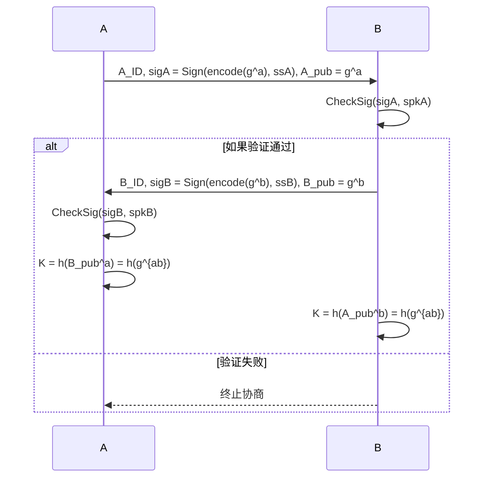

# Part1 研究动机与问题定义

---

## 1.1 为什么对 SIG\_DH 协议进行形式化验证？

* SIG\_DH（Signed Diffie-Hellman）是对经典DH协议的加固，加入了签名以防止中间人攻击。
* 尽管形式上“看起来安全”，**协议的安全性仍依赖细节实现与攻击者模型**。
* 随着实际部署中的攻击方式不断演化，需要系统化方法来验证协议是否真的达成安全目标。


## 1.2  SIG\_DH 协议面临的典型威胁

| 威胁类型         | 描述                                     |
| ------------ | -------------------------------------- |
| 🔓 **密钥泄漏**  | 私钥/签名密钥被窃取后，是否还能保护旧/未来会话密钥？（前向安全性、KCI） |
| 🎭 **身份伪造**  | 攻击者是否能冒充合法身份进行通信？                      |
| 🔄 **KCI攻击** | 被攻击者的私钥泄露后，攻击者是否能冒充“他人”与之通信？           |
| 👀 **公钥替换**  | 缺乏绑定机制时，攻击者是否能替换公钥、诱导错误信任？             |


## 1.3  传统分析方式的局限性

* 依赖“直觉”推理与非形式化论证，**容易遗漏边界条件与攻击路径**；
* 无法全面模拟复杂攻击者模型（如主动攻击者、密钥组合泄漏）；
* 人工分析成本高、难以重复验证。


## 1.4  🛠️ 为什么选择 ProVerif？

* ProVerif 是基于 Dolev-Yao 模型的自动验证工具；
* 支持无限会话分析、密码学原语建模、属性查询；
* 可以验证：

  * 保密性（secrecy）
  * 认证性（authentication）
  * 抗泄漏能力（leakage resistance）
  * 密钥确认等扩展属性。


---

#  Part2 ProVerif建模介绍


## 2.1 建模的目标与方式

### 2.1.1 为什么建模？

* 为了**在逻辑层面上精准描述协议**的行为与假设；
* 并使用自动化工具 ProVerif 进行**符号推理**，判断是否满足：

  * 会话密钥是否机密？
  * 是否存在身份伪造？
  * 若密钥泄露，是否仍有部分安全性可保留？

### 2.1.2 建模框架的五个核心组成：

| 组成     | 说明                       |
| ------ | ------------------------ |
| 实体（类型） | 定义了参与者能处理的对象（如群元素、密钥）    |
| 操作（函数） | 对象之间的组合与计算方式（如 $g^x$、签名） |
| 假设（等式） | 协议中**必须成立的等价规则**（如签名验证）  |
| 攻击者模型  | 攻击者能做什么、知道什么             |
| 协议过程   | 通信双方的行为与顺序               |


## 2.2 实体与操作的抽象
> ✅ ProVerif 中的函数/类型/过程 ≠ 编程语言中的“函数调用”
> ✅ 它们是符号逻辑系统中的“构造符号”和“推理规则”
在模型中，我们抽象如下内容：

* **类型（Type）**

  * `exp`: 指数（如 DH 中的随机数 $a, b$）
  * `group`: 群元素（如 $g^a$）
  * `sessionkey`: 会话密钥
  * `bitstring`: 二进制串，用于签名、编码等


在ProVerif中，type group. 并不表示“有一个群类对象”，而是声明“群元素”是一个逻辑集合。
它用于限制函数参数类型、生成新值等，并无实际计算含义。

* **函数（Function）**

  * 群运算：`g_exp(g, a)` 表示 $g^a$
  * 加解密：`asymenc(m, pk)` / `asymdec(c, sk)`
  * 签名操作：`sign(m, sskey)` / `checksig(sig, spkey)`
  * 哈希：`h(bits)` 表示从比特串导出会话密钥
  * 比如 `fun g_exp(group, exp): group.` 表示一个构造：把 $g$ 和 $a$ 组合成 $g^a$。它**不计算出具体值**，而是代表某种**符号组合方式**。如果没有等式（equation），ProVerif甚至无法“识别”两个 `g_exp(g,a)` 是否等于 `g_exp(g,b)`。

💡 **本质**：函数 ≈ 代数系统里的构造符号，用于拼出协议中出现的信息项。


* **等式（Equation）**

  * 唯有定义了：

    ```proverif
    equation checksig(sign(m,sk), spk(sk)) = m.
    ```

    才说明：这些函数的组合在某种情况下**可以“归约”成某个结果**。
  * 这不是计算结果，而是**逻辑归约规则**，供推理系统使用。

* **过程（process）**
  * 在编程语言中，process 通常是运行的代码。

  * 在ProVerif中，`process` 是**角色行为脚本**，它的含义是：
    > “A 会执行这些操作”、“B 期望接收这些消息并进行这些检查”。

  * 它构成了一个 **进程图**（process calculus），而不是运行中的程序状态。


## 2.4 攻击者模型假设

ProVerif 默认使用**Dolev-Yao模型**，它假设：

* 攻击者**控制整个通信网络**，可以：

  * 截获任何消息
  * 修改、组合已有消息
  * 重放或伪造消息（只要他“知道”里面的内容）

* 攻击者的初始知识包括：

  * 所有**公开参数**（如 $g$、所有公钥）
  * 如果模拟泄漏，还可以加入攻击者已知私钥：例如 `skA`


我们显式地描述哪些值是“公开的”，哪些是“私密的”，并声明攻击者是否能获得它们。


## 2.5 通信过程的行为建模（进程）

我们使用**结构化过程定义**描述参与者如何生成消息、接收消息、进行验证和计算。

例如，参与者 A 的行为模型（逻辑结构）：

1. **生成**自己的随机数 $a$，计算 $A_{pub} = g^a$
2. **对公钥签名**并发送 $[A\_ID, sigA, A\_pub]$
3. **接收**B 的公钥、签名与身份
4. **验证**签名是否对应 $B_{pub}$
5. 若验证成功，计算共享密钥 $K = h(g^{ab})

* 其实就是按某种顺序使用我们定义好的函数`func`和等式`equation`，并通过`process`描述参与者的行为。
* 在这个过程中，我们并不关心具体的计算细节，而是关注逻辑上的消息流转与验证。
* 通过`in` 和`out`关键字，我们可以在我们定义的`channel`上描述消息的发送与接收。


---

## 2.6 安全属性的事件记录与查询

我们定义**关键行为时刻为事件（event）**，更准确地说，它是 **证明系统中用于描述关键行为发生的“逻辑标志位”**，供我们后续验证协议的行为是否达成某种安全属性。

* ProVerif 中的 `event` ≠ 程序中的“事件触发”（js的`onClick`）
  * 它是：**“我声明此刻，我已经完成了某个逻辑动作”**
* 我们引入事件，是为了写出如下查询：

  ```proverif
  query inj-event(endB(peer, id, k)) ==> inj-event(beginA(id, peer, k)).
  ```
  * 可以将其理解为：
    > “如果我们发现 B 声称通信结束了，那么是否有确凿证据表明 A 曾经发起过对应的通信？”
  * ProVerif 会在**自动推理过程中**判断这个“因果关系”是否成立。

###  小结

建模思路由下至上：

1. 抽象参与实体、运算与规则；
2. 明确谁说了什么、怎么说、是否验证；
3. 添加攻击者与验证者角色；
4. 最终通过“事件追踪 + 查询”完成安全性验证。

---

很好，基于你已经列出的三条关键查询（保密性、单向认证、双向认证），我来整理出**第4部分：安全属性验证**的完整内容框架，适合用于Presentation中的技术讲解页，结合解释、推理目标和逻辑含义，突出ProVerif验证的“逻辑清晰性”和“自动化能力”。

---

# Part3 安全属性验证

安全属性是在协议运行过程中希望**始终成立的逻辑条件**。在形式化验证中，这些条件被建模为**可查询的逻辑公式（query）**，ProVerif 将尝试证明这些属性是否始终成立。


---

##  第1条：会话密钥保密性（Confidentiality）

```proverif
query x: sessionkey; attacker(x).
```

### ✦ 含义解释：

> *“是否存在某个会话密钥，攻击者可以推导出其值？”*

### ✦ 验证目的：

* 检查密钥是否会**在非授权路径中泄露**；
* 若 ProVerif 返回 **false**，说明**攻击者无法得知任何会话密钥（✅安全）**；
* 返回 **true** 表示存在攻击路径（❌不安全）。

### ✦ 举例情境：

* 若攻击者掌握了 B 的私钥，是否就能得出 $K = h(g^{ab})$？
* 此查询能捕获 **密钥派生函数中的弱点或公钥伪造攻击**。

---

## 第2条：发起者身份认证（Initiator Agreement）

```proverif
query na: bitstring, nb: bitstring, sk: sessionkey;
  event(endB(na, nb, sk)) ==> event(beginA(na, nb, sk)).
```

### ✦ 含义解释：

> *“如果 B 声称完成了和 A 的安全通信，A 是否真的发起过这场通信？”*

### ✦ 验证目的：

* 保证响应方不会“和一个不存在的 A”建立共享密钥；
* 若 ProVerif 返回 false，则可能存在：

  * 中间人攻击
  * 会话混淆攻击
  * 公钥替换攻击等

### ✦ 举例情境：

* 攻击者伪造 A 的身份与签名，使 B“误以为”是在和 A 通信；
* 此查询捕捉**单向身份伪造或替换攻击**。

---

## 第3条：双向认证 / 完整协议一致性（Mutual Agreement）

```proverif
query a_id: bitstring, b_id: bitstring, sk: sessionkey;
  event(endA(b_id, sk)) ==> event(endB(a_id, b_id, sk)).
```

### ✦ 含义解释：

> *“如果 A 声称通信完成，B 是否也成功参与并完成了这场通信？”*

### ✦ 验证目的：

* 防止 A 被攻击者诱导完成“伪会话”；
* 保证双方确实**对等达成一致**并成功交换密钥。

### ✦ 举例情境：

* 攻击者冒充 B 响应 A 的协商；
* A 认为协商成功，但 B 根本未参与 —— 此时 ProVerif 将返回 `false`。


### 🧠 形式化优势总结

* 可验证**是否存在任意攻击路径**导致属性失效；
* 支持模拟密钥泄漏、签名伪造、重放攻击等复杂场景；
* 所有验证结论都基于 ProVerif 的**归约逻辑**和**符号模型完备性**。

---

当然可以。以下是你要求的内容，整理成适用于Presentation或文档中的 **第4部分（Part 4）**，Markdown 标题等级统一使用 `#`：

---

# Part 4：安全属性验证 = 自动状态机路径约束检查

> everything is a statemachine .
  —— by jyy
---

## 4.1 ProVerif 建模 ≈ 自动化状态机构建

### 4.1.1 状态机结构类比

| 构件                   | ProVerif 中的含义 | 状态机类比       |
| -------------------- | ------------- | ----------- |
| `process`            | 协议执行流程        | 状态转移路径      |
| `new x`, `out`, `in` | 通信动作、密钥生成等    | 状态迁移边       |
| `if ... then`        | 分支逻辑          | 条件迁移        |
| `event name(...)`    | 行为发生断点        | 状态上标注的观察事件  |
| `equation`           | 可化简的等价规则      | 状态中隐含的简化映射  |
| `attacker` 知识        | 状态中可推导信息      | 信息标签 / 可达属性 |

这些构成了一台**符号系统的无限状态自动机**，ProVerif 会自动构造并穷尽其所有可能路径。

---

### 4.1.2 安全属性验证 ≈ 状态遍历条件判断

以 `event` 为核心，ProVerif 的验证方式可描述为：

> **“只要某个事件发生了，就检查是否必定发生过另一个事件”**
> 即：是否在所有执行路径中都满足某种逻辑条件。

#### 例如：

```proverif
event(endB(...)) ==> event(beginA(...))
```

含义是：

> “在任何一条执行路径中，如果 B 完成了通信（`endB`），那么之前一定发生过 A 启动通信（`beginA`）。”

 ProVerif 将自动在构建的符号状态机中检查该命题在所有路径上是否成立。

---

## 4.1 示例模型的自动状态机解释

```proverif
(* 类型定义 *)
type key.                  (* 密钥类型 *)
type sessionkey.           (* 会话密钥类型 *)

(* 函数定义 *)
fun senc(sessionkey, key): bitstring.
reduc forall k: key, sk: sessionkey; sdec(senc(sk, k), k) = sk.

(* 通道与密钥 *)
free c : channel.                (* 公共信道 *)
free k : key [private].          (* 预共享密钥，攻击者不知道 *)

(* 会话密钥 sk 由 A 生成 *)
(* 事件声明（可选） *)
event beginA(sessionkey).
event endB(sessionkey).

(* 安全性查询：攻击者是否能知道 sk？ *)
(* sk 会在 A 进程中通过 new 随机生成 *)
query attacker(new sk).

(* A：生成 sk，发送加密 sk *)
let A =
  new sk:sessionkey;
  event beginA(sk);
  out(c, senc(sk, k)).

(* B：接收、解密 sk *)
let B =
  in(c, m:bitstring);
  let sk = sdec(m, k) in
  event endB(sk).

(* 主进程：并发执行 A 与 B *)
process
  (!A | !B)

```

### 4.2.1 场景总览

定义了一个密钥分发模型，简化为：

* A 生成会话密钥 `sk`；
* A 使用共享密钥 `k` 对其加密后发送；
* B 接收并解密；
* 验证攻击者是否能获取 `sk`。

---

### 4.2.2  状态机构建要素

| 构件类型         | 内容         | 状态机含义         |
| ------------ | ---------- | ------------- |
| `new sk`     | 随机生成会话密钥   | 新状态：密钥生成      |
| `senc(sk,k)` | 加密得到密文 `m` | 信息变换，构成状态转移   |
| `out(c,m)`   | 发送密文       | 转移到“密文可达”状态   |
| `in(c,m)`    | 接收密文       | 改变接收方状态       |
| `sdec(m,k)`  | 解密得到 `sk'` | 如果密文匹配，即转移回密钥 |
| `event`      | 标记行为点      | 在状态机上打下“逻辑标签” |

---

### 4.2.3 状态结构图（简图）

```text
          +----------------+
          |   new sk       |
          | beginA(sk)     |
          +----------------+
                  |
                  v
          +---------------------+
          | sk' = senc(sk, k)   |
          +---------------------+
                  |
                  v
          +----------------------+
          | out(c, m)            |
          +----------------------+
                  |
   ================ Interception =================
                  |
                  v
          +----------------------+
          | in(c, m')            |
          +----------------------+
                  |
                  v
          +----------------------+
          | sk'' = sdec(m', k)   |
          | endB(sk'')           |
          +----------------------+
```

* 若 `m' = senc(sk, k)`，解密成功，`sk'' = sk`；
* 若 `m'` 被攻击者篡改，结果不确定（但模型未做失败处理）。

---

### 4.2.4 安全属性验证过程

* 预设条件回顾

  * `k` 是通过 `free k : key [private]` 声明的，攻击者 **初始不可知**；
  * 加密函数 `senc(sk, k)` 没有等式反向定义（除了解密规则）；
  * ProVerif 的攻击者是 **Dolev-Yao 模型下的符号攻击者**，只能组合、替代、匹配、归约，不会猜测或爆破。

---

####  第1条：攻击者是否已知 `k`？ → 否

* 在 ProVerif 中：

  ```proverif
  free k : key [private].
  ```

  表示这个密钥 `k` **没有通过公共信道传输，也未在 process 中被泄露**；
* ProVerif 构建自动状态机时，攻击者状态中永远**无法包含 `k`**；
* 所以：在所有路径中，`k ∉ attacker knowledge` ⇒ **无法得知**。

---

####  第2条：攻击者是否能从 `senc(sk, k)` 推导出 `sk`？ → 否


* 在自动机中的某个状态，攻击者确实能**窃听到消息** `m = senc(sk, k)`（即 out 通道上出现了）；
* 但：

  * `senc(...)` 没有可逆公式（即没有定义 `sdec(m, ?) = sk` 之类的反向等式）；
  * 唯一的等式：

    ```proverif
    sdec(senc(sk, k), k) = sk
    ```

    需要满足攻击者**已知 `k`**，才能展开推理路径；
* 而从第1条已知：攻击者 **不知道 `k`**；

所以这个路径的自动机归约将**终止于密文符号 `senc(sk,k)`**，无法“化简”得到 `sk` ⇒ **ProVerif 判为不可达**。

---

####  第3条：是否存在其他路径使攻击者得知 `sk`？ → 否

ProVerif 会从完整自动机中搜索如下路径：

> “是否有任何路径中，攻击者能推导出 `sk`？”

可以想象 ProVerif 自动机遍历如下所有变体：

* `sk` 是否被明文传出？（否）
* `sk` 是否参与了加密/签名结构，并以攻击者可解方式流出？（否）
* 是否有主动的 B 向通道回传了解出的 `sk`？（模型中没有）
* 是否攻击者可控制或猜测密文结构构造？（模型中不可）

所以：

* 所有路径都不满足“攻击者可达 `sk`”的逻辑条件；
* 即使考虑攻击者构造 `m' ≠ senc(sk,k)` 去尝试欺骗 B，也无法使其返回 `sk`（模型中未定义 B 的反应）；
* 更重要的是，ProVerif 确认没有**任何可约路径**导致 `sk` 被纳入 `attacker knowledge`。

#### 综上：
**符号自动机中没有一条路径能推导出 `sk`** ⇒ **返回 `attacker(sk)` 为 `false`。**
这些“否”源于 **自动机上的信息不可达性** 和 **归约逻辑失败**，是 ProVerif 对全状态空间做完逻辑推理后的结论。

> 结论：**攻击者在任意执行路径中都无法恢复 `sk`，协议满足保密性。**

> **ProVerif 构造协议的自动状态机，而安全性验证就是判断某些逻辑条件在所有状态路径上是否始终成立。**

---


#  Part5 SIG_DH 协议概述（简略）

## 5.1  协议参与者与目标

* **参与者**：

  * $A$：主动发起者，拥有签名密钥对 $(sk_A, spk_A)$
  * $B$：响应者，拥有签名密钥对 $(sk_B, spk_B)$

* **目标**：

  * 双方协商共享密钥 $K = h(g^{ab})$
  * 并**通过签名验证彼此身份**

---


## 5.2 SIG\_DH 协议的数学过程

设：

* 公共参数：生成元 $g \in \mathbb{G}$，群 $\mathbb{G}$
* $A$ 拥有私钥 $sk_A$，签名私钥 $ss_A$，公钥 $pk_A = g^{sk_A}$，签名公钥 $spk_A$
* $B$ 拥有私钥 $sk_B$，签名私钥 $ss_B$，公钥 $pk_B = g^{sk_B}$，签名公钥 $spk_B$

---

### 5.2.1协议步骤（数学形式）

1. **A → B**：

   * 生成随机数 $a \in \mathbb{Z}_q$，计算 $A_{pub} = g^a$
   * 签名 $\sigma_A = \text{Sign}( \text{encode}(A_{pub}), ss_A )$
   * 发送 $A\_ID, \sigma_A, A_{pub}$

2. **B 验证并响应**：

   * 验证签名：$\text{CheckSig}( \sigma_A, spk_A ) = \text{encode}(A_{pub})$
   * 若验证成功：

     * 生成 $b \in \mathbb{Z}_q$，计算 $B_{pub} = g^b$
     * 签名 $\sigma_B = \text{Sign}( \text{encode}(B_{pub}), ss_B )$
     * 发送 $B\_ID, \sigma_B, B_{pub}$
     * 计算共享密钥 $K = h( (A_{pub})^b ) = h( g^{ab} )$

3. **A 验证并完成协商**：

   * 验证签名：$\text{CheckSig}( \sigma_B, spk_B ) = \text{encode}(B_{pub})$
   * 若验证成功，计算共享密钥 $K = h( (B_{pub})^a ) = h( g^{ab} )$

---

### 5.2.2 协议流程图（交互图）


---

# Part 6：SIG\_DH 安全验证结果与演化分析

以下是根据你提供的 `result.md` 与 `output.txt` 文件整理出的完整 Markdown 报告草稿。内容包括每个版本的改进点、攻击者知识集、攻击路径（描述性表示），并附上六个版本的安全属性矩阵热力图。

---

## 6.1 协议版本列表

| 版本编号 | 协议文件名            | 主要特征                     |
| ---- | ---------------- | ------------------------ |
| V1   | `dh_with_no_sig` | 原始 DH + A 单向签名           |
| V2   | `dh_with_sig`    | A/B 双向签名但无身份绑定           |
| V3   | `sig_dh_fixed`   | 使用非对称加密封装 B 公钥和签名        |
| V4   | `sig_dh_fixed7`  | 使用对封装后的公钥与签名做 pair 发送    |
| V5   | `sig_dh_fixed10` | 加入 A\_ID, B\_ID 做哈希绑定    |
| V6   | `sig_dh_fixed11` | 引入 `sid_A`, `sid_B` 会话绑定 |

---

## 6.2分节分析

### V1: `dh_with_no_sig.pv`

* **改进目标**：最原始版本，仅 A 签名。
* **攻击者知识集**：

  ```
  attacker(g), attacker(pkA), attacker(pkB), attacker(B_pub)
  ```
* **主要问题**：B 没有任何签名，A 接收到的 B 公钥无法验证身份。
* **攻击路径**：

  ```
  attacker 可构造 B_pub → send to A → A 接受并完成 endA
  ```
* **验证结论**：

  * 会话密钥泄漏 ✅
  * 会话不一致 ✅

---

### V2: `dh_with_sig.pv`

* **改进点**：加入 B 对 `B_pub` 的签名。
* **攻击者知识集**：

  ```
  attacker(g), attacker(pkA), attacker(pkB), attacker(B_pub), attacker(g^a), attacker(g^b)
  ```
* **核心问题**：认证通过，但 g^ab 是公开计算的，攻击者可恢复会话密钥。
* **攻击路径**：

  ```
  attacker 得到 g^a, g^b → 计算 g^{ab} → 得到 h(g^{ab})
  ```
* **验证结论**：

  * 保密性 ❌
  * 一致性 ✅

---

### V3: `sig_dh_fixed.pv`

* **改进点**：B 使用 `pkA` 加密打包发送 `(B_pub, sigB, sk)`。
* **攻击者知识集**：

  ```
  attacker(pkA), attacker(pkB), attacker(sigA), attacker(enc(B_pub, sigB, sk))
  ```
* **问题残留**：会话密钥 sk 派生自公开群值，仍可计算。
* **攻击路径**：

  ```
  attacker 得到加密包，无法解密；但 sk 可被推导 h(g^{ab})
  ```
* **验证结论**：

  * 保密性 ❌
  * 一致性 ✅

---

### V4: `sig_dh_fixed7.pv`

* **改进点**：封装 A 公钥，签名分开发送，B 也封装后发送 pair。
* **攻击者知识集**：

  ```
  attacker(A_ID), attacker(enc_A_pub), attacker(sigA), attacker(pair(enc_B_pub, sigB))
  ```
* **问题**：缺乏身份绑定，攻击者仍可回放或转发伪造封包。
* **验证结论**：

  * 保密性 ❌
  * 一致性 ✅

---

### V5: `sig_dh_fixed10.pv`

* **改进点**：哈希中引入 A\_ID, B\_ID → 使用 `h(A_ID || B_ID || g^{ab})`。
* **攻击者知识集**：

  ```
  attacker(enc_A_pub), attacker(sigA), attacker(enc_B_pub), attacker(sigB)
  ```
* **攻击防御**：加入身份绑定后，g^ab 的派生不可用。
* **验证结论**：

  * 保密性 ✅
  * 一致性 ✅

---

### V6: `sig_dh_fixed11.pv`

* **改进点**：引入 `sid_A`, `sid_B` 作为每次会话绑定项，签名时携带身份与随机串。
* **攻击者知识集**：

  ```
  attacker(msgA = pair(g^a, A_ID, sid_A)), attacker(enc(g^a)), attacker(sigB)
  ```
* **优势**：抗重放、可唯一标识身份与会话。
* **验证结论**：

  * 保密性 ✅
  * 一致性 ✅

---


## 6.3 分析结论与建议

* SIG\_DH 通过形式化验证工具 ProVerif 实现了：

  * 逐步发现与修复身份认证、消息绑定、密钥协商中的多种漏洞；
  * 通过事件组合与归约推理检测认证属性与保密性；
* ❌ 但在面对密钥泄漏（尤其是私钥或签名密钥泄漏）时，协议结构无法完全阻止伪造连接；
* 📌 结论：**SIG\_DH 协议缺乏对强攻击模型（如 KCI、泄漏）的根本性防御机制**，建议采用更强的认证密钥绑定方式，如：

  * 身份嵌入共享密钥导出过程；
  * 增加 key confirmation 机制；
  * 使用零知识绑定替代纯签名结构。

---


# Part8 附录与工具支持

- 1. [知乎:使用Proverif分析TLS 1.3协议](https://zhuanlan.zhihu.com/p/534666160)
- 2. [Proverif官网](https://bblanche.gitlabpages.inria.fr/proverif/)
- 3. [Formal verification of Telegram chat protocol MTProto 2.0](https://github.com/miculan/telegram-mtproto2-verification)